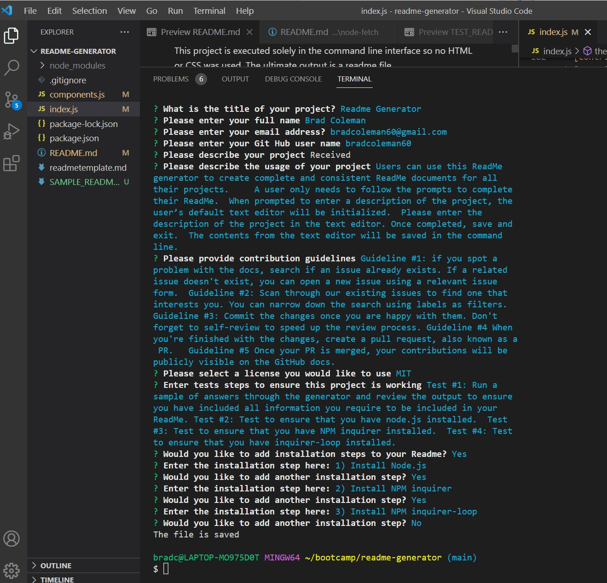

# readme-generator

# **Table of Contents**
1. [Description](#description)
2. [Testing](#testing)
3. [Technology Used and Credits](#technology-used-and-credits)
4. [About the Author](#about-the-author)
5. [License](#license)


# **Description**

The goal of this project was to create a ReadMe.md generator using Node.js and the command line. This was my first project using Node.js and no html or css.   This required the use of a NPM package - inquirer.  Additionally, I used an additional NPM package - inquirer-loop which allowed me to loop my questions depending on user input.  

This project is executed solely in the command line interface so no HTML or CSS was used.  The ultimate output is a readme file.  

Below is a screen shot of the command line interface at the completion of the questions. 




Link to Demonstration Video of how this Generator Works:

https://app.vidcast.io/share/c6d1a746-76c3-4a06-bc24-f510ae42cf43

# **Highlighted Code Example**

The following is code that I created that I would like to highlight.  This highlights the use the Node inquirer package.  

This code handles the object array of all the answers that are asked in the command line.  Most notable is the use of object destructuring that occurs on the 5th line of the code below.  This is an short way of being able to reference the values by their variable names instead of the lengthier method of using dot notation.    

```
//This logs the answers
  .then((answers) => {
    console.log(answers);
    //Using object destructuring made variables equal to the keys in the answer object
    const { title, author,email, github, description, license, installationSteps,installationSteps2,usage,contribution,testSteps } = answers;
    
    //Deconstruct the installation steps to ensure that that only values are retrieved
    var outputData2 = installationSteps2.map(Object.values)

    // Function used to create the installation steps that can be input into the template literal
    var installString = ''
    createInstallationString(outputData2)
    function createInstallationString (outputData2){
      for (i = 0; i < outputData2.length; i++){
      installString = installString + outputData2[i] + '\n'
      } 
    }

    //Pass variables to the settestContent function 
    settextContent(title, author, email, github, description, license,  installationSteps,installationSteps2,usage,contribution,testSteps, installString  );
    
  });

```
The following code is how I ensured that a valid email address was input into the email prompt. 

```
{
      type: "input",
      name: "email",
      message: "Please enter your email address?",
      validate(answer) {if (answer =='' || answer.indexOf('@') == -1 || answer.indexOf('.') == -1){
        return 'Please enter a valid email address'}
        return true
      }
    },

```
Lastly, I used a plug in to add for question looping.  This is the syntax that allows for looping questions.  In this instance, I wanted to ensure that the user could input as main installation steps as needed.  After an installation step is entered, the user is asked if they want to enter another step.  If so, the prompt to enter another step is rendered.  If not, the questions are ended.  

```
{
      type:'confirm',
      name: "installationStepsNeeded",
      message: "Would you like to add installation steps to your Readme?",
    },
    {
      type: 'input',
      name: 'installationSteps',
      message: 'Enter the installation step here:',
      when: (answers) => answers.installationStepsNeeded === true

    },
    {
      type:'loop',
      name: 'installationSteps2',
      message: "Would you like to add another installation step?",
      when: (answers) => answers.installationStepsNeeded === true,
      questions: [
        {
          type: 'input',
          name: 'installationSteps2',
          message: 'Enter the installation step here:'
        }
      ]
    }
```


# **Testing** 

To test to ensure the code rendered the desired output I iterated a series of tests to ensure that all acceptance criteria were met and documented completion below:

1. WHEN I am prompted for information about my application repository THEN a high-quality, professional README.md is generated with the title of my project and sections entitled Description, Table of Contents, Installation, Usage, License, Contributing, Tests, and Questions

 - **Completed**.  The readme is produced and has all required components. 

2. WHEN I enter my project title THEN this is displayed as the title of the README

 - **Completed**.  The title is placed at the top of the ReadMe. 

3. WHEN I enter a description, installation instructions, usage information, contribution guidelines, and test instructions THEN this information is added to the sections of the README entitled Description, Installation, Usage, Contributing, and Tests

 - **Completed**.  All of these items are placed in the correct spot. 

4. WHEN I choose a license for my application from a list of options THEN a badge for that license is added near the top of the README and a notice is added to the section of the README entitled License that explains which license the application is covered under

 - **Completed**.  The badge for the selected license is placed at the top of the page and the verbiage of the license is in the body of the readme. 

5. WHEN I enter my GitHub username THEN this is added to the section of the README entitled Questions, with a link to my GitHub profile

 - **Completed**.  The git hub username is entered at the bottom of the page in Questions.   

 6. WHEN I enter my email address THEN this is added to the section of the README entitled Questions, with instructions on how to reach me with additional questions

 - **Completed**.  The email is entered at the bottom of the page in Questions.   

 7. WHEN I click on the links in the Table of Contents THEN I am taken to the corresponding section of the README

 - **Completed**.  The navigation links work.    


# **Technology Used and Credits**

I used many useful references in completing this project including the following.  In particular, I found the layout of the w3schools reference materials to be extremely intuitive and helpful.  They even have a "try me" feature where elements of code can be reviewed and tested. 


| Technology Used | Resource URL | 
| ------------- |:-------------| 
|  | [https://git-scm.com/](https://git-scm.com/) | 
|  | [https://developer.mozilla.org/en-US/docs/Learn/JavaScript](https://developer.mozilla.org/en-US/docs/Learn/JavaScript) |
|  | [https://nodejs.org/en/](https://nodejs.org/en/) |
|  | [https://api.jquery.com/](https://api.jquery.com/) |

# **About the Author**

My name is Brad Coleman. I am fairly new to web development but have considered it a hobby for several years and have hacked my way through learning various aspects including php, html and mysql.  I am currently enrolled in the Cal Berkeley Extension Web Development Boot camp and am excited to learn web development more holistically.  I have spent my earlier career working as a corporate controller / CPA.

- [Linkedin Profile](https://www.linkedin.com/in/brad-coleman-109529/)
- [GitHub Repos](https://github.com/bradcoleman60?tab=repositories)


# **License**

MIT License

Copyright (c) 2022 Brad Coleman

Permission is hereby granted, free of charge, to any person obtaining a copy
of this software and associated documentation files (the "Software"), to deal
in the Software without restriction, including without limitation the rights
to use, copy, modify, merge, publish, distribute, sublicense, and/or sell
copies of the Software, and to permit persons to whom the Software is
furnished to do so, subject to the following conditions:

The above copyright notice and this permission notice shall be included in all
copies or substantial portions of the Software.

THE SOFTWARE IS PROVIDED "AS IS", WITHOUT WARRANTY OF ANY KIND, EXPRESS OR
IMPLIED, INCLUDING BUT NOT LIMITED TO THE WARRANTIES OF MERCHANTABILITY,
FITNESS FOR A PARTICULAR PURPOSE AND NONINFRINGEMENT. IN NO EVENT SHALL THE
AUTHORS OR COPYRIGHT HOLDERS BE LIABLE FOR ANY CLAIM, DAMAGES OR OTHER
LIABILITY, WHETHER IN AN ACTION OF CONTRACT, TORT OR OTHERWISE, ARISING FROM,
OUT OF OR IN CONNECTION WITH THE SOFTWARE OR THE USE OR OTHER DEALINGS IN THE
SOFTWARE.


GIVEN a weather dashboard with form inputs
WHEN I search for a city
THEN I am presented with current and future conditions for that city and that city is added to the search history
WHEN I view current weather conditions for that city
THEN I am presented with the city name, the date, an icon representation of weather conditions, the temperature, the humidity, and the wind speed
WHEN I view future weather conditions for that city
THEN I am presented with a 5-day forecast that displays the date, an icon representation of weather conditions, the temperature, the wind speed, and the humidity
WHEN I click on a city in the search history
THEN I am again presented with current and future conditions for that city
```